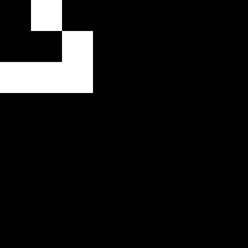
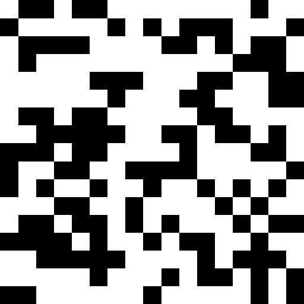
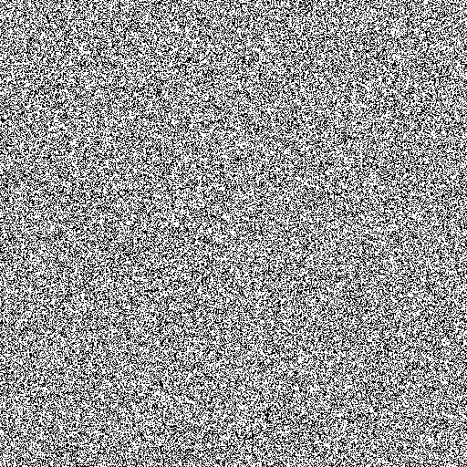
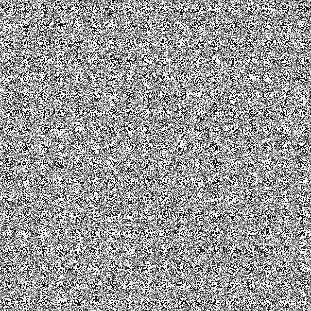

# Жизнь на торе

## Краткое описание
**Жизнь на торе** — реализация клеточного автомата «Игра Жизнь» на прямоугольной сетке n x m с периодическими граничными условиями.  
Поле замкнуто в тор: клетки на верхней границе соседствуют с нижней, на левой — с правой. Моделирование ведётся по классическим правилам Конвея, но взаимодействие учитывает переходы через края.

---

## Правила игры
- Каждая клетка является либо живой, либо мёртвой.
- Каждая клетка имеет **8 соседей** (с учётом тороидальности).
- **Рождение**: мёртвая клетка становится живой, если ровно три соседа живы.
- **Выживание**: живая клетка остаётся живой при двух или трёх живых соседях.
- **Смерть**: в остальных случаях клетка погибает (от одиночества или перенаселения).

---

## Плюсы и минусы

### Плюсы
- Отсутствие краевых эффектов — все клетки равноправны.
- Возможность моделировать бесконечную динамику на конечной сетке.
- Удобство для изучения периодических и зацикленных структур.

### Минусы
- Топология тора может искажать поведение классических паттернов (например, глайдеры, уходя за край, возвращаются с другой стороны).
- Не подходит для задач, где важны граничные условия открытого типа.

---

## Взаимодействие с ботом

Бот @LiveThorBot позволяет создавать GIF-анимации игры «Жизнь на торе» двумя способами: случайная генерация поля или ввод собственной стартовой конфигурации.
Команды: 

- **/start** – приветственное сообщение.
- **/help** – список всех команд и их описание.
- **/get H W p** – генерация случайного поля размером H x W с вероятностью жизни p (0 < p < 1).
- **/get n m** – начало диалога для ввода собственного поля размером n x m. После этой команды бот ожидает сообщение, содержащее ровно n строк, каждая из m символов (только 0 и 1). Строки разделяются переносом.

Примечания:

- Все GIF создаются с разрешением 512 x 512 пикселей (исходное поле масштабируется без потери чёткости).
- Количество кадров по умолчанию – 80, частота – 4 кадра в секунду.
- рекомендуется генерировать поля размером n x m, и n либо делит 512 либо n -- мало относительно 512 (пример 31), также для m 

## Примеры

- глайдер

- случайное поле малого размера

- поле максимального размера

